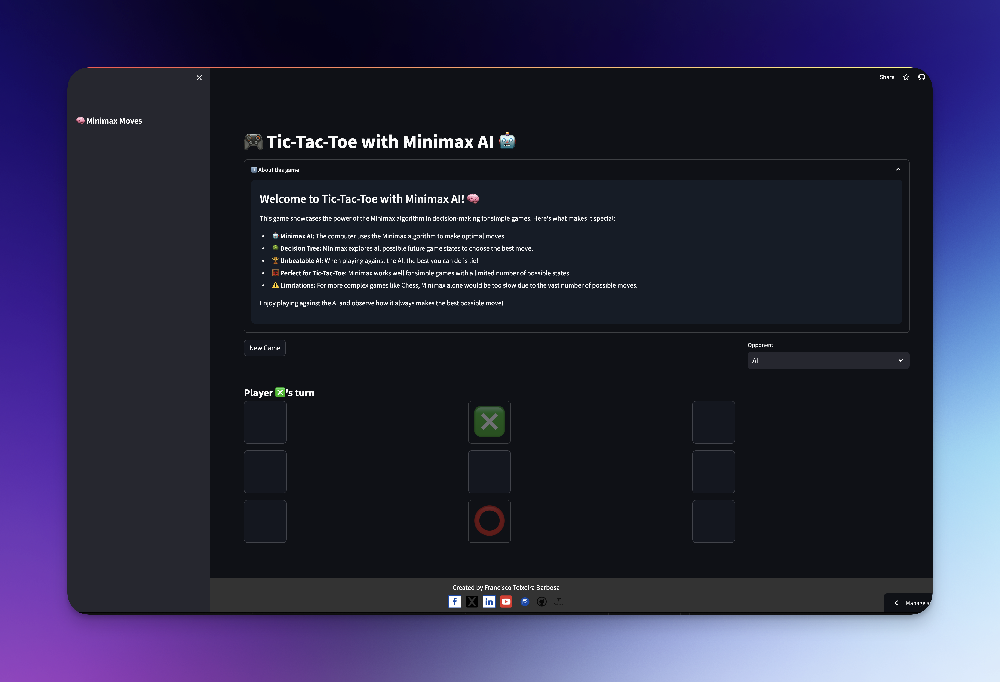

# 🎮 Tic-Tac-Toe Game with Minimax AI

## 🌟 Project Description

Welcome to the Tic-Tac-Toe Game repository! This project implements a classic Tic-Tac-Toe game using Python, featuring an AI opponent that uses the minimax algorithm. It's a perfect blend of fun and artificial intelligence, created as a demonstration of AI decision-making in simple games.

[View the repository](https://github.com/Tuminha/Tic-Tac_toe-Game-)



[Play the game online](https://tic-tac-toe-tuminha.streamlit.app/)

## 📋 Table of Contents

- [Installation](#installation)
- [Usage](#usage)
- [Project Structure](#project-structure)
- [The Minimax Algorithm](#the-minimax-algorithm)
- [Components](#components)
  - [tictactoe.py](#tictactoepy)
  - [runner.py](#runnerpy)
  - [tictactoe_test.py](#tictactoe_testpy)
  - [Streamlit App](#streamlit-app)
- [Contributing](#contributing)
- [License](#license)
- [Acknowledgments](#acknowledgments)

## 🚀 Installation

To get this game up and running on your local machine, follow these steps:

1. Clone the repository:
   ```
   git clone https://github.com/Tuminha/Tic-Tac_toe-Game-.git
   ```
2. Navigate to the project directory:
   ```
   cd Tic-Tac_toe-Game-
   ```
3. Install the required dependencies:
   ```
   pip install -r requirements.txt
   ```

## 🕹️ Usage

To start the game locally, run the following command in your terminal:

To play the game online, visit: [Tic-Tac-Toe Streamlit App](https://link-to-your-streamlit-app.com)

## 🏗️ Project Structure

The project consists of the following main components:

- `tictactoe.py`: Contains the core game logic and the minimax algorithm implementation.
- `runner.py`: Provides a Pygame-based graphical interface for playing the game.
- `tictactoe_test.py`: Includes unit tests for the game logic.
- Streamlit App: Offers an online version of the game (code not provided in this repository).

## 🧠 The Minimax Algorithm

The minimax algorithm is a decision-making algorithm used in two-player turn-based games. It's designed to find the optimal move for a player, assuming that the opponent also plays optimally. Here's how it works:

1. The algorithm recursively simulates all possible game states resulting from all possible moves.
2. It assigns a score to each final state (win, lose, or draw).
3. For the maximizing player (usually the AI), it chooses the move with the highest score.
4. For the minimizing player (usually the human), it assumes they will choose the move with the lowest score.
5. This process continues until it reaches the current game state, determining the best move.

Advantages of Minimax:
- Guarantees the best possible move assuming optimal play from both sides.
- Works perfectly for simple games like Tic-Tac-Toe.

Limitations of Minimax:
- Can be computationally expensive for complex games.
- Assumes the opponent always makes the optimal move, which may not be true in real-world scenarios.

## 🧩 Components

### tictactoe.py

This file contains the core game logic and the minimax algorithm implementation. Key functions include:

- `initial_state()`: Returns the starting state of the board.
- `player(board)`: Determines which player's turn it is.
- `actions(board)`: Returns all possible actions for the current board state.
- `result(board, action)`: Returns the board that results from making a move.
- `winner(board)`: Determines the winner of the game, if any.
- `terminal(board)`: Checks if the game is over.
- `utility(board)`: Assigns a score to a terminal board state.
- `minimax(board)`: Implements the minimax algorithm to determine the best move.

### runner.py

This file provides a graphical interface for the game using Pygame. It handles:

- Game initialization and setup
- User input for choosing X or O
- Drawing the game board and pieces
- Handling player moves and AI moves
- Displaying game status and results

### tictactoe_test.py

This file contains unit tests for the game logic implemented in `tictactoe.py`. It tests various scenarios to ensure the correctness of the game's core functions.

### Streamlit App

The Streamlit app provides an online version of the game, allowing users to play Tic-Tac-Toe against the AI from their web browsers. It offers a user-friendly interface and showcases the power of the minimax algorithm in action.

[Play the game online](https://link-to-your-streamlit-app.com)

## 🤝 Contributing

Contributions to this project are welcome! Please feel free to submit a Pull Request.

## 📄 License

This project is licensed under the MIT License - see the [LICENSE.md](LICENSE.md) file for details.

## 🙏 Acknowledgments

- Thanks to Harvard's CS50 AI course for inspiring this project.
- Pygame community for their excellent documentation.
- Streamlit for making it easy to create web apps with Python.

---

Created with ❤️ by Francisco Barbosa (cisco)  
Email: cisco@periospot.com